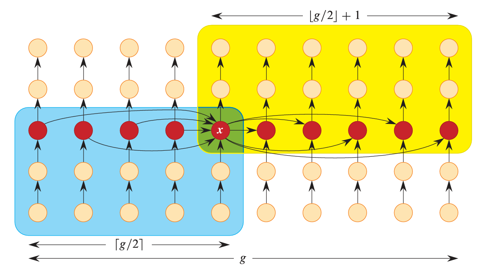

# Prerequisite Algorithm
- [[Quick Sort]]
- [[Random Selection]]
- [[Divide and Conquer]]
# Description
이전에 살펴 본 [[Random Selection]]알고리즘에는 약점이 존재했다. 그것은 바로 최악의 경우 O(N^2)의 시간 복잡도를 갖는다는 것이다. 

이러한 불안정성을 Median of Medians라는 알고리즘을 도입하여 개선한 selection 알고리즘에 대해서 다룬다.
# Implementation
## Code

``` Rust
/// median of medians 알고리즘을 기반으로 n번째로 작은 값을 슬라이스의 n번째 인덱스로 이동시킵니다.
///
/// 최악의 경우에도 O(N) 시간복잡도를 보장합니다.
/// 피벗 선택을 median of medians 방식으로 수행하여, 균형 잡힌 분할을 유도합니다.
///
/// # 매개변수
/// - `slice`: 정렬 대상 슬라이스입니다.
/// - `n`: 정렬하여 얻고자 하는 인덱스입니다.
///
/// # 예시
/// ```
/// let mut slice = [3, 2, 10, 5, -6, 77];
/// select::select_nth_elem_strict(&mut slice, 4);
/// assert_eq!(slice[4], 10);
/// ```
pub fn select_nth_elem_strict<T: Ord>(slice: &mut [T], n: usize) {
    // sort left over
    let mut l = 0usize;
    let r = slice.len();
    let mut target = n;
    
    // base case
    if r == 0 || r <= n {
        return;
    }
    
	// step 1, Size adjustment
    while ((r - l) % 5) != 0 {
        for i in (l + 1)..r {
            if slice[l] > slice[i] {
                slice.swap(l, i);
            }
        }

        // early search
        if target == 0 {
            return;
        }
        l += 1;
        target -= 1;
    }

    // median of medians
    // step 2, grouping : slice를 크기 5인 그룹으로 분할하고, 각 group을 정렬
    let group_size = (r - l) / 5;
    for start in l..(l + group_size) {
        sort_five_in_place_with_stride(slice, start, group_size);
    }

    // get pivot using median of median
    // select median group
    select_nth_elem_strict(
        &mut slice[(l + 2 * group_size)..(l + 3 * group_size)],
        group_size / 2,
    );
    let mut median_of_median = 2 * group_size + group_size / 2; // use median of median as a pivot
    // partition slice using median of median as a pivot
    median_of_median = hoare_partition(&mut slice[l..r], median_of_median);

    // divide conquer
    if median_of_median != target {
        if target < median_of_median {
            select_nth_elem_strict(&mut slice[l..l + median_of_median], target);
        } else {
            select_nth_elem_strict(
                &mut slice[(l + median_of_median + 1)..r],
                target - median_of_median - 1,
            );
        };
    }
}
```

## About Code
### Core Idea - Median of Medians
selection알고리즘의 성능은 partitioning의 횟수에 달려있는데, 이 partitioning의 횟수는 pivot의 선택에 달려있음을 이전 [[Random Selection]] 에서 확인할 수 있었으며, random으로 pivot을 선택한 결과, 양 극단에 가까운 pivot을 고를수록 그 성능이 감소함 또한 확인할 수 있었다.

Median of Medians(이하 MoMs)는 "중간 값들의 중간 값"이라는 뜻으로, 탐색의 대상이 될 slice를 일정한 크기의 group으로 분할한 다음, 각 group의 중간 값을 모아 새로운 그룹(Medians)를 구성하고, 이 중간 값 그룹에서 중간 값을 찾는 알고리즘이다. 이렇게 MoMs를 pivot으로 삼는 경우 어느 정도 이상의 균형을 약속한다. 

구체적인 수행 과정은 다음과 같다. 
#### 1. Slice size adjustment
주어진 slice를 일정한 크기의 그룹으로 분할하기 위해서, 그룹으로 분할하고 남는 나머지를 정리해줄 필요가 있다. 따라서 이들 나머지를 slice의 한 쪽 끝으로 정렬한다.  
``` Rust
	// step 1, Size adjustment
    while ((r - l) % 5) != 0 {
        for i in (l + 1)..r {
            if slice[l] > slice[i] { // 최솟값을 찾아서 왼쪽 끝으로 이동
                slice.swap(l, i);
            }
        }

        // early search
        if target == 0 {
            return;
        }
        // 탐색 범위 축소
        l += 1;
        target -= 1;
    }
```
일반적으로 그룹의 크기는 5로 설정하는데, 그 이유는 추후에 있을 그룹 별 정렬의 비용을 O(1)으로 만들기 위해서이다.
#### 2. Grouping
selection의 범위 내의 원소를 크기 5인 그룹으로 나눈다. 여기서 그룹은 인덱스를 `num_group`으로 나눈 나머지가 같은 것을 하나의 그룹으로 삼는다. 이렇게 분할하면 각 그룹은 불연속하게 위치하지만, `num_group`을 stride로 하여 일정하게 떨어져 있게 된다.
#### 3. Sort Group
앞서 분할한 각 group을 정렬한다. 한 그룹의 원소는 5개로 구성된다.
``` Rust
let num_group = (r - l) / 5;
    for start in l..(l + num_group) {
        sort_five_in_place_with_stride(slice, start, num_group);
    }
```
각 그룹을 정렬했으므로, 각 그룹의 3번째 원소는 중간 값이 된다.
#### 4. select median of medians
앞서 각 그룹을 정렬한 결과 3번째 원소는 중간 값이 된다. 그 결과, slice의 `l+2*num_group..l+3*num_group`은 각 group의 중간 값들만 모은 새로운 group이 된다. 여기서 재귀적으로 selection을 수행, 다시 한 번 중간 값을 탐색한다.
``` Rust
// get pivot using median of median
    // select median group
    select_nth_elem_strict(
        &mut slice[(l + 2 * group_size)..(l + 3 * group_size)],
        group_size / 2,
    );
    let mut median_of_median = 2 * group_size + group_size / 2; // use median of median as a pivot
```
이후의 partioning 및 탐색 대상의 값이 위치한 part에 대해서 재귀적으로 select를 호출하는 부분은 이전과 동일하다.
# Analysis
## Time Complexity - worst O(N)

### Median of Medians

*image from Introduction to Algorithms, 4ed*
위 그림은 median of medians의 관계를 나타낸 것이다. 각 원은 selection의 대상이 되는 원소를 의미하며, 화살표는 해당 원소 사이의 대소관계를 의미한다. 화살표가 향하는 대상이 상대적으로 큰 것을 나타낸다. 세로로 존재하는 5개 원소가 하나의 그룹을 구성하며, 붉은 색으로 표현된 원은 해당 그룹의 median을 나타낸다. 끝으로 3번 행의 붉은 원소가 각 그룹의 median이며, x는 그 median of medians이다. 

여기서 푸른 색으로 표현된 영역은 x보다 작거나 같은 값들의 영역이며, 노란 색으로 표현된 영역은 x보다 크거나 같은 영역이다. 따라서, 이 MoMs로 선택한 pivot인 x는 최악의 경우에도 3/10은 배제할 수 있게 된다. **다시 말하자면, MoMs의 pivot으로 인해서 매 재귀 호출은 탐색 범위를 7/10이하로 줄이는 효과를 얻을 수 있다.**

이를 slice size에 대한 등비수열로 접근, 등비수열의 무한 합을 취하면 최종 시간 복잡도는 다음과 같다.
$$\sum_{i=0}^{\inf} N ({7 \over 10})^i = N{10 \over 3}$$
따라서, MoMs로 인한 최종 시간 복잡도는 `O(N)`이다.
## Spatial Complexity - worst O(N)
입력의 크기와 관련된 그 어떠한 공간도 추가로 할당하지 않으므로, 각 호출은 O(1)의 공간 복잡도를 갖는다. 

다만, 해당 알고리즘이 재귀적인 호출 구조를 가지고, 별도의 재귀 최적화를 받지 못하므로, 최악의 경우 O(N)에 비례하는 호출 횟수를 갖는다.

따라서 총 공간 복잡도는 O(N)이다.
# Summary
MoM Selection 알고리즘은 이전에 살펴 본 random selection 알고리즘의 약점이었던 최악의 경우 O(N^2)이라는 점을 보완하기 위해서 개발된 알고리즘이다.

selection의 최악의 경우는 극단으로 치우친 pivot을 선택하는 과정에서 발생하므로, Median of Medians 테크닉을 도입하여 pivot의 위치를 어느 정도 보장하도록 하였다. 

이 Median of Medians 알고리즘의 비용은 O(N)이며, 이렇게 선택된 pivot은 양 극단에서 적어도 3/10만큼 떨어지는 것이 보장된다. 

다만, Median of Medians는 최악의 경우를 보장하기는 하지만, 현실적인 상황에서 최악의 경우가 미치는 영향이 극히 미미한 관계로, 평균 성능은 [[Random Selection]]에 비해 떨어진다. 그래서 잘 채택되진 않는다.
# References
- Introduction to Algorithms 4th ed